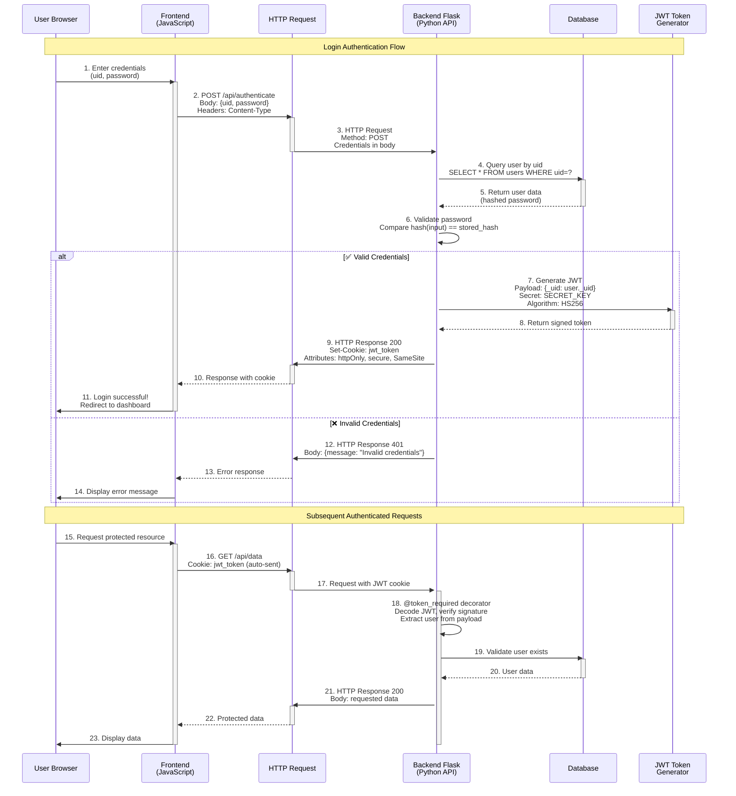

## What You Will Learn

Authentication workflow and key concepts (HTML login, HTTP, APIs, credentials, sessions, JWT tokens, password hashing, CORS).

**Key HTTP & JWT Concepts Illustrated:**

1. **HTTP POST Request** (Steps 2-3): Frontend sends credentials via HTTP POST with JSON body
2. **Password Hashing** (Step 6): Backend compares hashed passwords, never plain-text
3. **JWT Generation** (Steps 7-8): Creates signed token containing user identity using HS256 algorithm
4. **HTTP Cookie** (Step 9): JWT stored in secure, httpOnly cookie (prevents XSS attacks)
5. **Automatic Cookie Transmission** (Step 16): Browser automatically sends cookie with subsequent requests
6. **Token Validation** (Step 18): `@token_required` decorator decodes JWT and verifies signature
7. **CORS & Credentials** (Steps 2, 16): `credentials: 'include'` in fetch allows cross-origin cookie transmission

### Authentication Workflow with HTTP and JWT

The diagram below visualizes the complete authentication flow, from initial login through subsequent authenticated requests:



## Frontend HTML

For our frontend, we need a basic outline for our UI. For example, here is the basic HTML login code I created for this site. The attributes we usually see for the login form include username and password.

In accordance with the ideation page, the "username" corresponds with the `uid` element in the backend, so the request payload should include the `uid`.

For our outline though, the "uid" attribute would be hard for users to understand. What does it mean to them? Since the "uid" attribute should be the user's GitHub ID, the label should be GitHub ID. That way, users know how to fill in the form correctly.

(If you need information about styling a login form for your website, you can click on the Style tab above for information about using SASS.)

```python
<div class="login-container">
    <!-- Python Login Form -->
    <div class="login-card">
        <h1 id="pythonTitle">User Login (Python/Flask)</h1>
        <form id="pythonForm" onsubmit="pythonLogin(); return false;">
            <p>
                <label for="uid">
                    GitHub ID:
                    <input type="text" name="uid" id="uid" required>
                </label>
            </p>
            <p>
                <label for="password">
                    Password:
                    <input type="password" name="password" id="password" required>
                </label>
            </p>
            <p>
                <button type="submit">Login</button>
            </p>
            <p id="message" style="color: red;"></p>
        </form>
    </div>
</div> 
```

## Backend Code

If you generated a template from the flask_2025 repository backend, you should have user.py file under model and the user.py file under api. The code needed for authenticating a user's credentials and generating a JSON Web Token for them is already provided for your in these files here:

The following block of code  is  from user.py in the api directory, under the Security class. It processes the HTTP request from the frontend, authenticates the user, and generates a JWT for their session.

```python
class _Security(Resource):
    def post(self):
        try:
            body = request.get_json()
            if not body:
                return {
                    "message": "Please provide user details",
                    "data": None,
                    "error": "Bad request"
                }, 400
            ''' Get Data '''
            uid = body.get('uid')
            if uid is None:
                return {'message': f'User ID is missing'}, 401
            password = body.get('password')
            if not password:
                return {'message': f'Password is missing'}, 401
                        
            ''' Find user '''

            user = User.query.filter_by(_uid=uid).first()
            
            if user is None or not user.is_password(password):
                
                return {'message': f"Invalid user id or password"}, 401
                        
            # Check if user is found
            if user:
                try:
                    token = jwt.encode(
                        {"_uid": user._uid},
                        current_app.config["SECRET_KEY"],
                        algorithm="HS256"
                    )
                    resp = Response("Authentication for %s successful" % (user._uid))
                    resp.set_cookie(current_app.config["JWT_TOKEN_NAME"], 
                            token,
                            max_age=3600,
                            secure=True,
                            httponly=True,
                            path='/',
                            samesite='None'  # This is the key part for cross-site requests

                                        # domain="frontend.com"
                        )
                    print(token)
                    return resp 
                except Exception as e:
                    return {
                                    "error": "Something went wrong",
                                    "message": str(e)
                                }, 500
            return {
                            "message": "Error fetching auth token!",
                            "data": None,
                            "error": "Unauthorized"
                        }, 404
        except Exception as e:
                return {
                            "message": "Something went wrong!",
                            "error": str(e),
                            "data": None
                        }, 500
```

- Login and Token Generation: Validates user credentials and generates a JWT, representing a read operation to verify data with a POST request.
- Accessing the Database Page: Uses a GET request to retrieve and display user credentials, also a read operation as no data modification occurs.

If you look at methods in the backend, other than the post  function for creating a user under CRUD class and for authenticating a user under security function, there is a decorator called `@token_required()`. What does this function do?

Take a look at jwt-authorize.py and **read the comments** to understand what `@token_required()` does. You don't have to understand every line of code, because we are still in the process of learning. However, it is important understand why we use `@token_required()` and why it is important in authentication.

```python
from flask import request
from flask import current_app, g
from functools import wraps
import jwt
from model.user import User

def token_required(roles=None):
    '''
    This function is used to guard API endpoints that require authentication.
    Here is how it works:
      1. checks for the presence of a valid JWT token in the request cookie
      2. decodes the token and retrieves the user data
      3. checks if the user data is found in the database
      4. checks if the user has the required role
      5. set the current_user in the global context (Flask's g object)
      6. returns the decorated function if all checks pass
    Here are some possible error responses:    
      A. 401 / Unauthorized: token is missing or invalid
      B. 403 / Forbidden: user has insufficient permissions
      C. 500 / Internal Server Error: something went wrong with the token decoding
    '''
    def decorator(func_to_guard):
        @wraps(func_to_guard)
        def decorated(*args, **kwargs):
            token = request.cookies.get(current_app.config["JWT_TOKEN_NAME"])
            if not token:
                return {
                    "message": "Authentication Token is missing!",
                    "data": None,
                    "error": "Unauthorized"
                }, 401
            try:
                # Decode the token and retrieve the user data
                data = jwt.decode(token, current_app.config["SECRET_KEY"], algorithms=["HS256"])
                current_user = User.query.filter_by(_uid=data["_uid"]).first()
                if current_user is None:
                    return {
                        "message": "Invalid Authentication token!",
                        "data": None,
                        "error": "Unauthorized"
                    }, 401
                    
                # Check user has the required role, when role is required 
                if roles and current_user.role not in roles:
                    return {
                        "message": "Insufficient permissions. Required roles: {}".format(roles),
                        "data": None,
                        "error": "Forbidden"
                    }, 403
                    
                # Success finding user and (optional) role
                # Set the current_user in the global context
                # Flask's g object is a global object that lasts for the duration of the request
                # The g.current_user can be referenced in decorated function 
                g.current_user = current_user
            
            # Error exception is for unknown jwt.decode errors 
            except Exception as e:
                return {
                    "message": "Something went wrong decoding the token!",
                    "data": None,
                    "error": str(e)
                }, 500

            # Success, return to the decorated function
            # func_to_guard is the function with the @token_required
            # func_to_guard returns with the original function arguments
            return func_to_guard(*args, **kwargs)

        return decorated

    return decorator

```

To summarize, the global variable `g.current_user` allows us to access and update user information  if they are logged in with the decorator `@token_required()`. This helps us avoid other, more tedious methods, like using local storage to store id information or decoding JWT tokens; The magic of a token being passed with every HTTP request allows us to use a decorator to obtain user information through `@token_required()`.   FYI, if the user isn't logged in, they won't be able to obtain information from the function guarded by the `@token_required()` decorator.

## Frontend API Service Layer

Since the backend code is done for us, all we need is the frontend API layer to send the request to the backend. The idea is when a user submits the form, their credentials will be validated, and they will be authenticated against the database. Part of this code is under the script tag.

```javascript
<script type="module">
    import { login, pythonURI, fetchOptions } from '{{site.baseurl}}/assets/js/api/config.js';

    // Function to handle Python login
    window.pythonLogin = function() {
        const options = {   
            URL: `${pythonURI}/api/authenticate`,
            callback: pythonDatabase,
            message: "message",
            method: "POST",
            cache: "no-cache",
            body: {
                uid: document.getElementById("uid").value,
                password: document.getElementById("password").value,
            }
        };
        login(options);
    }
</script>
```

If you looked at the sign up code, you might have noticed the same import statement from the frontend `API Service Layer`. You also might notice that the frontend `API Service Layer` is a lot shorter than the sign-up code. Why is that?

If we look closely, we see that login is imported from config.js. Let's take a look at config.js.

```javascript
export var pythonURI;
if (location.hostname === "localhost") {
        pythonURI = "http://localhost:8587";
} else if (location.hostname === "127.0.0.1") {
        pythonURI = "http://127.0.0.1:8587";
} else {
        pythonURI =  "https://flask.opencodingsociety.com";
}
export var javaURI;
if (location.hostname === "localhost") {
        javaURI = "http://localhost:8585";
} else if (location.hostname === "127.0.0.1") {
        javaURI = "http://127.0.0.1:8585";
} else {
        javaURI = "https://spring.opencodingsociety.com";
}

export const fetchOptions = {
    method: 'GET', // *GET, POST, PUT, DELETE, etc.
    mode: 'cors', // no-cors, *cors, same-origin
    cache: 'default', // *default, no-cache, reload, force-cache, only-if-cached
    credentials: 'include', // include, same-origin, omit
    headers: {
        'Content-Type': 'application/json',
        'X-Origin': 'client' // New custom header to identify source
    },
};
// User Login Function 
export function login(options) {
        // Modify the options to use the POST method and include the request body.
        const requestOptions  = {
                ...fetchOptions, // This will copy all properties from options
                method: options.method, // Override the method property
                cache: options.cache, // Set the cache property
                body: JSON.stringify(options.body)
        };

        // Clear the message area
        document.getElementById(options.message).textContent = "";

        // Fetch JWT
        fetch(options.URL, requestOptions)
        .then(response => {
                // Trap error response from Web API
                if (!response.ok) {
                        const errorMsg = 'Login error: ' + response.status;
                        console.log(errorMsg);
                        document.getElementById(options.message).textContent = errorMsg;
                        return;
                }
                // Success!!!
                // Redirect to the Database location
                options.callback();
        })
        .catch(error => {
                // Handle network errors
                console.log('Possible CORS or Service Down error: ' + error);
                document.getElementById(options.message).textContent = 'Possible CORS or service down error: ' + error;
        });
}

```

As you can see, we use the exported  `login function` from `config.js` and pass our parameters accordingly in the the frontend `API Service Layer`. Exporting function may be useful to you to make code shorter and more efficient If you want to learn about updating/reading a lot of user information in a modularized, efficient  approach, check out Profile in the navigation bar!

Also, did you take a look at `fetchOptions`? The fetchOptions are essential for handling Cross-Orgin-Site Requests (CORS) involving JWTs. In simple terms, this is what make sure the server "knows" we're logged in, and we have rights to access and update information about ourselves on the server. These same fetchOptions will be needed for most of our requests where a token is required.

Check out [this link](https://developer.mozilla.org/en-US/docs/Web/API/Fetch_API/Using_Fetch) if you are interested in learning more about CORS.

As you can see in the HTTP Request, the method is a POST, which corresponds to the method in the backend. It's important that we use the correct method for our specific API endpoint, or we will get errors. For example, for the _Security , the api endpoint is api/authenticate. Therefore, the correct api endpoint we should use is the request  is `/api/authenticate`.

Here's the code in the backend API that sets up the endpoint:

```python
user_api = Blueprint('user_api', __name__,
                     url_prefix='/api')
```

This code is for the user.py file under the api directory. The 'api' prefix is applied to all endpoints in the user.py file and is defined at the beginning of the file.

```python
api.add_resource(_Security, '/authenticate')
```

This adds '/authenticate' to the _Security class endpoint. Therefore, the full API endpoint is `/api/authenticate`

You can try using  [Postman](https://learning.postman.com/docs/introduction/overview/) to test out your  backend API on flask_2025 before starting this part! If you're running flask_2025 locally add the `api/user` to the [localhost](https://blog.hubspot.com/website/what-is-localhost#:~:text=Typically%2C%20you%20can%20access%20the,running%20on%20the%20same%20device.) link.

## Error Handling

What does the try/catch error block do in the login function for config.js? The try block attempts to `send a payload` to the backend in order to `process the response`.  If the payload is incorrectly formatted, or there is any other issue with the request, an error will be thrown. The catch block catches this error and logs an appropriate message to the console.

> What's an example of an error we talked about?

- A 401 error

Developers can always check the console and use Postman to understand how to debug code. Thus, logging the error in the console is important. But why is the login message involved? In order for users to have a seamless experience, they need to be informed of how their actions led to  the error. (How that error translates to the user's mistake is up to developers presentation.)

In this case, we have a login message element that details the error so text pops up on their screen when they make a mistake.  However, alerting the user might be a viable option as well.

## Glossary of Key Terms

### Authentication Concepts

- **Authentication**: The process of verifying the identity of a user or system by checking credentials (usernames, passwords) to confirm their identity before granting access.

- **Authorization/Access Control**: Determines what actions or resources an authenticated user can access based on their role or permissions.

- **Credentials**: Information used to verify identity, such as usernames, passwords, and sometimes additional factors like security questions or biometrics.

- **Session Management**: Mechanism to keep track of authenticated users and manage their interactions with the web application. Sessions can involve storing session data on the server or using tokens to identify users.

- **Token-Based Authentication**: A method where users receive a token (like JWT) upon successful login. This token is sent with each request to authenticate the user without re-submitting credentials.

### Security & Cryptography

- **Password Hashing**: Storing passwords securely by converting them into a hash using cryptographic algorithms. This ensures plain-text passwords are never stored in the database. (See `set_password` function in user.py model directory)

- **JWT (JSON Web Token)**: A compact, URL-safe token format for transmitting claims between parties. Consists of three parts: header, payload, and signature. Used for stateless authentication.

- **HS256 Algorithm**: HMAC with SHA-256 hashing algorithm used to sign JWT tokens with a secret key, ensuring token integrity and authenticity.

- **httpOnly Cookie**: A cookie flag that prevents JavaScript from accessing the cookie, protecting against XSS (Cross-Site Scripting) attacks.

- **Secure Cookie**: A cookie flag that ensures the cookie is only transmitted over HTTPS connections, protecting against man-in-the-middle attacks.

- **SameSite Cookie**: A cookie attribute that controls whether cookies are sent with cross-site requests, helping prevent CSRF (Cross-Site Request Forgery) attacks.

### HTTP & Web Concepts

- **CORS (Cross-Origin Resource Sharing)**: A security feature that allows or restricts resources on a web server to be requested from another domain. Essential for frontend-backend communication across different origins.

- **credentials: 'include'**: A fetch option that tells the browser to include cookies and authorization headers with cross-origin requests.

- **HTTP Status Codes**:
  - **200 OK**: Successful request
  - **401 Unauthorized**: Authentication required or failed
  - **403 Forbidden**: User authenticated but lacks permissions
  - **500 Internal Server Error**: Server-side error during processing

### Flask-Specific Terms

- **@token_required Decorator**: A Python decorator that guards API endpoints by validating JWT tokens in request cookies before allowing access to protected routes.

- **Flask g Object**: A global object that stores data for the duration of a single request. Used to store `current_user` after JWT validation, making user data accessible throughout the request lifecycle.

- **Blueprint**: Flask's way of organizing related routes. The `user_api` Blueprint groups all user-related endpoints under the `/api` prefix.

- **Resource Class**: Flask-RESTful's way of defining API endpoints. Each HTTP method (GET, POST, PUT, DELETE) becomes a class method.

### Workflow Stages

1. **User Registration**: Users create an account by providing information (username, password). Passwords are hashed and stored securely in the database.

2. **User Login**: Users provide credentials, server verifies by comparing hashed password with stored hash, then creates a session or issues a JWT token.

3. **Session/Token Management**: For session-based auth, a session ID is stored on the server and a cookie sent to client. For token-based auth, the JWT is included in request cookies.

4. **Protected Route Access**: Subsequent requests include the JWT cookie, which is validated by the `@token_required` decorator before granting access to protected resources.

## Next Steps

You now have a solid foundation for creating secure login systems in Flask. This knowledge can be extended to implement:

- User registration and profile management
- Password reset functionality
- Role-based access control (RBAC)
- Multi-factor authentication (MFA)
- OAuth integration (Google, GitHub, etc.)

Happy coding!
