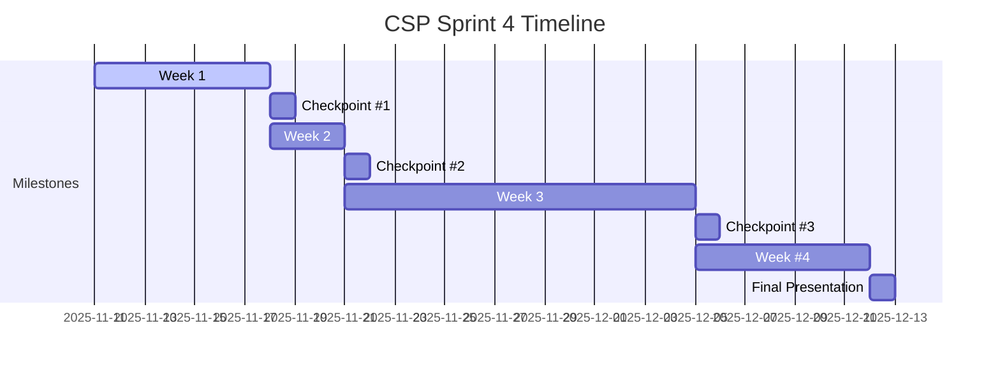

## A. Unit Description

### CSP Trimester 2: Full Stack Development — Sprint 4

**Overview:**

This sprint moves beyond the prototype phase of your Moving West Coast Travel or Digital Famine project. You will transition from a front-end demo to a fully functional full-stack application, integrating a live backend using Python Flask.

The goal is to demonstrate your ability to design, develop, and deploy a web application that includes:

- Persistent data management
- User interaction and authentication
- Dynamic content and performance tracking

These components will fulfill your APCSP Create Performance Task requirements, including code, video, and written reflection.

**Subject and Grade:**  
Computer Science, Grades 10–12

**Delivery Model:**

- Teacher-led demonstrations of Flask server setup and coding
- Students follow along on their own devices, building each component step-by-step
- Peer collaboration and live troubleshooting occurs during demonstration
- Formative checkpoints and group discussions after each major milestone

#### Visual Timeline (Gantt)

#### Visual Timeline (Table)

| Milestone                | Date           | Description                                                                 |
|--------------------------|----------------|-----------------------------------------------------------------------------|
| Checkpoint #1            | Tue, Nov 18    | Backend setup, login prototype, and team plan for quest/API simplification   |
| Checkpoint #2            | Fri, Nov 21    | Quest redesign: interactive features, UI/UX improvements, and user tracking  |
| Checkpoint #3            | Fri, Dec 5     | API endpoints, database integration, and admin dashboard prototype           |
| Sprint Close / Final Pres| Fri, Dec 12    | Full-stack quest system live demo and individual APCSP deliverables          |

---

### Major Deliverables

The following systems and deliverables will guide your progress through the sprint and ensure alignment with APCSP Create Performance Task requirements:

#### 1. Flask Login System (Foundational)

**Focus:** Understanding and using authentication (cookies, sessions), user identification, and authorization as a foundation for all other deliverables.

**Usage:**

- Students will use Flask's login-required features to ensure users are identified and authorized before accessing or modifying quest and API/Admin features.
- The login system is critical for enabling personalized quest experiences and secure data management.

**Tasks:**

- Demonstrate and practice user registration, login, and logout using Flask sessions.
- Apply login-required decorators to protect quest and admin routes.
- Store and retrieve user data (e.g., profile details, quest progress, and achievements) as part of the quest and admin deliverables.

**Deliverable:**
A demonstrated understanding and correct usage of authentication and authorization, supporting secure and individualized quest and admin features.

#### 2. Quest Simplification & Experience Design

**Focus:** Refine your quest flow and enhance usability and motivation.

**Tasks:**

- Simplify or redesign your existing quest structure, reducing 20+ steps into 6–8 meaningful stages for your team.
- Apply your best UI/UX ideas to improve clarity and engagement of user/learner.
- Convert static lessons or activities into interactive challenges — such as code races, timed events, or live competitions.
- Record user performance and outcomes into your database for analytics or leaderboard features.

**Deliverable:**
An interactive, engaging, and data-driven quest experience that demonstrates thoughtful design and backend integration.

#### 3. API / Database Design & Admin Interface

**Focus:** Data modeling, CRUD operations, and administrative management tools.

**Tasks:**

- Design a database schema for storing quests, user progress, and results.
- Build Flask routes and API endpoints for data access and updates.
- Create an Admin Dashboard (using Python/Jinja) to view and manage users, quests, and progress.
- Ensure data integrity and security across all operations.

**Deliverable:**
A fully operational backend with a simple yet functional admin UI for managing application data.

---

#### Instructor Requirements / Guidance

By the end of this sprint, each student should be able to:

- Explain their individual contribution and its impact on the full system.
- Show how that individual contribution meets College Board requirements.
- Demonstrate understanding of how frontend and backend communicate.
- Prepare to record a 1-minute silent video showing their individual contribution, user features, and data management.

---

## B. Standards-Based Evaluation & Improvements

### 1. Standard B: Content, Indicator B3  
*Source: [NSQOL Standards](https://nsqol.org/the-standards/quality-online-courses/)*

**Digital literacy and communication skills are incorporated and taught as an integral part of the curriculum.**

a. **Current Alignment:**

- In-person, students practice digital literacy by using command-line tools, GitHub, and VS Code, but communication is mostly verbal or via in-class collaboration.
- *Example:* Students clone a repo and run Flask locally, but may not document their process or communicate progress online effectively.

b. **Improvement for E-Learning (Aligned to Deliverables):**

- For the **Login System**, students will review authentication and user management features in GitHub Issues, practicing technical communication and feature review.
- For **Quest Design**, students will collaborate on UI/UX improvements and interactive features, sharing progress and feedback in Slack and GitHub Issue discussions.
- For **API/Admin**, students will use Kanban boards and PRs to coordinate backend/API implementation, and code admin screens and dashboards.
- All phases require digital communication, peer review, and portfolio blogging in Jupyter Notebooks and GitHub.

c. **Supporting Tool:**

- Slack, VSCode, GitHub Issues, Kanban Board, Pull Requests, and Jupyter Notebooks.  All elements practice synchronous or asynchronous communication and digital literacy.

---

### 2. Standard C: Instructional Design, Indicator C8  
*Source: [NSQOL Standards](https://nsqol.org/the-standards/quality-online-courses/)*

**The course design provides opportunities for learner-instructor interaction, including opportunities for regular feedback about learner progress.**

a. **Current Alignment:**

- In-person, feedback is immediate and informal during coding sessions.
- *Example:* Teacher and Teacher Aide circulates and gives real-time help until table teams have ability to progress independently.

b. **Improvement for E-Learning (Aligned to Deliverables):**

- **Login System:** Formative checkpoints for understanding of registration, login, and user data features, with students submitting screenshots or code for instructor and peer feedback.
- **Quest Design:** Checkpoint feedback on quest flow, UI/UX, and engagement features, with group check-ins and peer review of interactive challenges.
- **API/Admin:** Checkpoint reviews of API endpoints, database design, and admin dashboard functionality, with feedback cycles at each milestone.
- Synchronous and asynchronous feedback is provided via Jupyter Notebooks, Slack, and GitHub PRs.

c. **Supporting Tool:**

- Jupyter Notebooks with embedded formative tasks, Slack for group check-ins, and GitHub PRs for code review and feedback.

---

### 3. Standard D: Learner Assessment, Indicator D3  
*Source: [NSQOL Standards](https://nsqol.org/the-standards/quality-online-courses/)*

**Assessment practices provide frequent and varied opportunities for self-monitoring and reflection of learning.**

a. **Current Alignment:**

- In-person, students reflect verbally or in journals, but not always consistently.
- *Example:* End-of-lesson reflections or group discussions/checkpoints where verbal communication assist instructor to see if standards are being achieved.

b. **Improvement for E-Learning (Aligned to Deliverables):**

- **Login System:** Self-checks and reflection prompts after implementing authentication and user data features into Quest, with peer review of code and user experience design.
- **Quest Design:** Milestone-based self-assessment for quest simplification, UI/UX, and engagement, with peer and instructor feedback on interactive elements.
- **API/Admin:** Reflection and review of database design, API endpoints, and admin dashboard, with self-monitoring of progress via checklists and GitHub Issues.
- Project is broken into a Sprint with four checkpoints, each mapped to a major deliverable and formative assessment.

c. **Supporting Tool:**

- Embedded Microblog Forms, Jupyter Notebook markdown cells, and GitHub Issues for reflection, self-assessment, and milestone tracking.

---

### 4. Standard F: Course Technology, Indicator F3  
*Source: [NSQOL Standards](https://nsqol.org/the-standards/quality-online-courses/)*

**The course technology allows for customization and personalization.**

a. **Current Alignment:**

- In-person, students can choose project topics but follow the same technical steps.
- *Example:* All students build the same basic Flask app, but build or adapt APIs to meet their prototype project from Trimester 1 (ie Digital Famine or West Coast Quest frontend).
- Additionally students are expected to build project according to requirements to meeting College Board performance task.

b. **Improvement for E-Learning (Aligned to Deliverables):**

- **Login System:** Students can personalize user profiles and authentication flows, adding custom fields or features.
- **Quest Design:** Teams and individuals can redesign quest stages, UI, and challenges to reflect their interests and creativity.
- **API/Admin:** Students can extend the backend with unique endpoints, admin features, or analytics tailored to their project vision.
- Project regrouping and mashups encourage reduction to favorite concepts and delivery of smaller, more personalized projects.

c. **Supporting Tool:**

- GitHub branching, project templates, PRs, and GitHub Pages blogs for customization, collaboration, and final submission.

---

### 5. Additional Standard (e.g., Standard E: Accessibility, Indicator E2)  
*Source: [NSQOL Standards](https://nsqol.org/the-standards/quality-online-courses/)*

**The course provides alternative means of access to course materials.**

a. **Current Alignment:**

- In-person, teacher provides help as needed, but materials may not be accessible to all learners.

b. **Improvement for E-Learning (Aligned to Deliverables):**

- **Login System:** Ensure authentication and user features are accessible (e.g., clear forms, keyboard navigation, alt text for avatars).
- **Quest Design:** Provide alternative formats for quest content, captions for videos, and accessible UI for interactive challenges.
- **API/Admin:** Admin dashboards and data tools should be screen reader compatible and support high-contrast modes.
- All deliverables require adherence to web accessibility guidelines and accessible documentation.

c. **Supporting Tool:**

- Accessible Jupyter Notebooks, web accessibility best practices, and inclusive design in all deliverables.

---

## C. Sources

- National Standards for Quality Online Courses. [NSQOL Standards](https://nsqol.org/the-standards/quality-online-courses/)
