---

toc: True
layout: post
data: tools
title: Linux Operating System and Tools Setup
description: Setup guide for using Linux (Ubuntu, Kali, Mint) for development.
categories: ['DevOps']
author: John Mortensen
permalink: /tools/os/linux
breadcrumb: True 
---

## Installation Hack

Welcome to your journey of setting up your Operating System and Tools! This setup process will guide you through working in a Linux terminal, managing folders, cloning a project, and adding packages.

## Visual Representation of the Workflow

```mermaid
flowchart TD
    A["💻 Open Terminal"] 
    B["📁 Linux Commands<br>mkdir, cd, ls"]
    C["📁 Clone Project<br>git clone https://<your-repo>"]
    D["🛠️ Activate Tools<br>Ruby, Python, Git"]

    A --> B --> C --> D 
```



## Shell Commands

You’ll use standard Unix shell commands:

- Linux: `ls`, `pwd`, `mkdir`, `cd`, `git`, `cat`

## Version Control Commands

- **git clone**: Make a working copy of a git repository from the cloud to your local machine.
- **git pull**: Update your local copy of the repository with changes from the cloud repository.
- **git commit**: Save changes to files in your local repository.
- **git push**: Send updates from your local repository to the remote repository.

## Package Manager Commands (apt) – Ubuntu, Kali, Mint 

- **Update package list:** `sudo apt update`
- **Upgrade installed packages:** `sudo apt upgrade`
- **Install a package:** `sudo apt install <package_name>`
- **Remove a package:** `sudo apt remove <package_name>`
- **Search for a package:** `apt search <package_name>`
- **List installed packages:** `apt list --installed`

---

## Linux Setup

### Install VSCode

[VSCode link, Select Debian, Ubuntu OS and select default on prompts](https://code.visualstudio.com/download)

### Install Chrome

[Chrome, Select Debian](https://www.google.com/chrome/browser-tools/)

### Install Git package

```bash
sudo apt update
sudo apt install git
```

---

## Linux Project Setup

### First-time Setup

Run these commands to set up your developer tools for the first time.

```bash
mkdir opencs
cd opencs
git clone https://github.com/Open-Coding-Society/student.git
cd student/
./scripts/activate_ubuntu.sh # all Linux variants can use Ubuntu script
./scripts/activate.sh # prompts for Git UID and Personal Email
./scripts/venv.sh
```

#### System Checks (Optional)

Open Terminal

Run these commands to verify your system setup and check installed tools.

```bash
python --version
pip --version
ruby -v
bundle -v
gem --version
git config --global --list
```

#### Restarting a terminal

Open New Terminal, close existing terminal

Each time you open a new terminal session, run these commands to activate your environment and start working on the student project in VS Code.

```bash
cd opencs/student
source venv/bin/activate
code .
```
